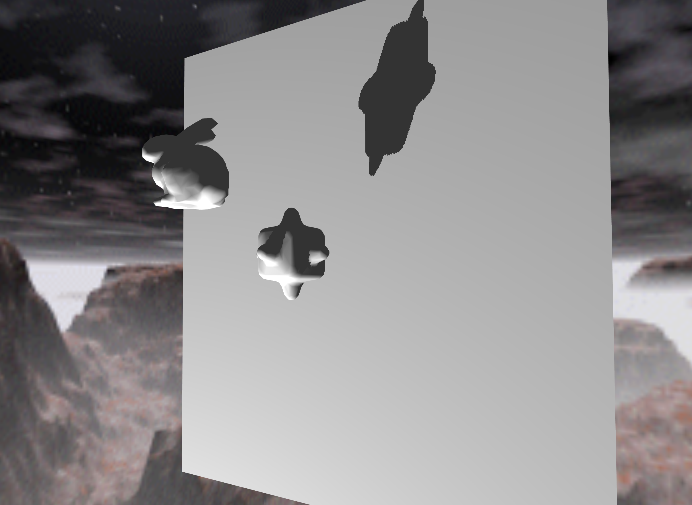
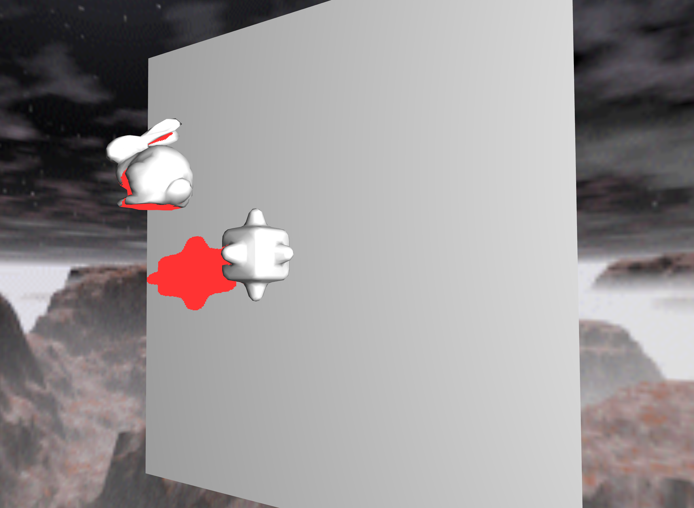
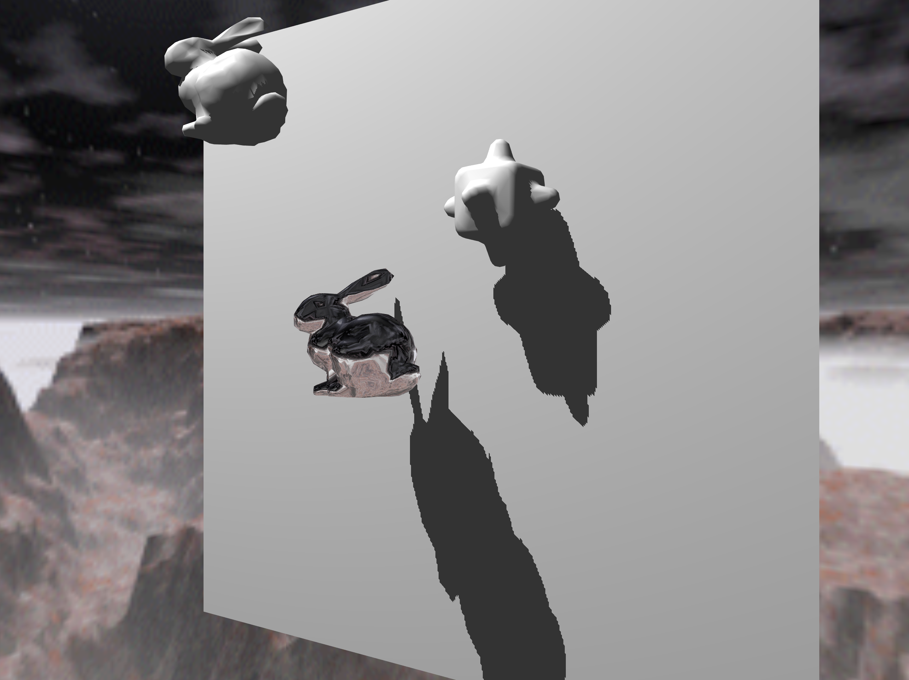
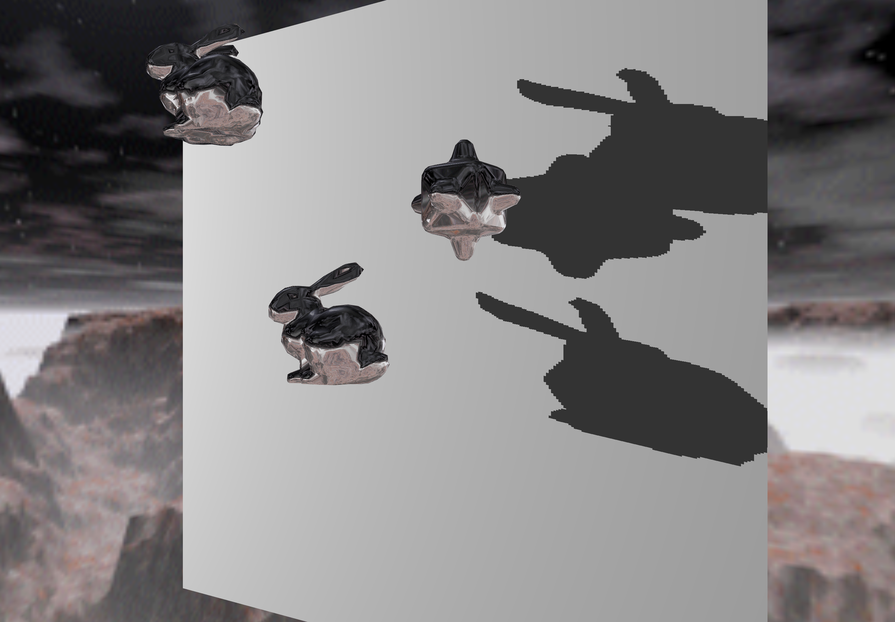
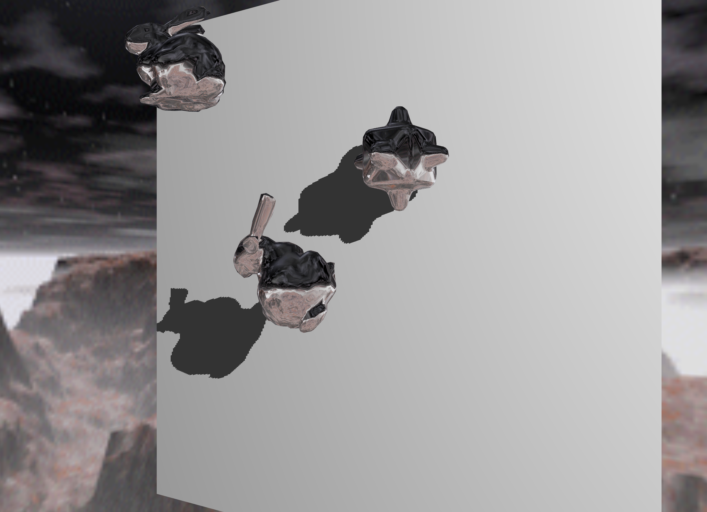
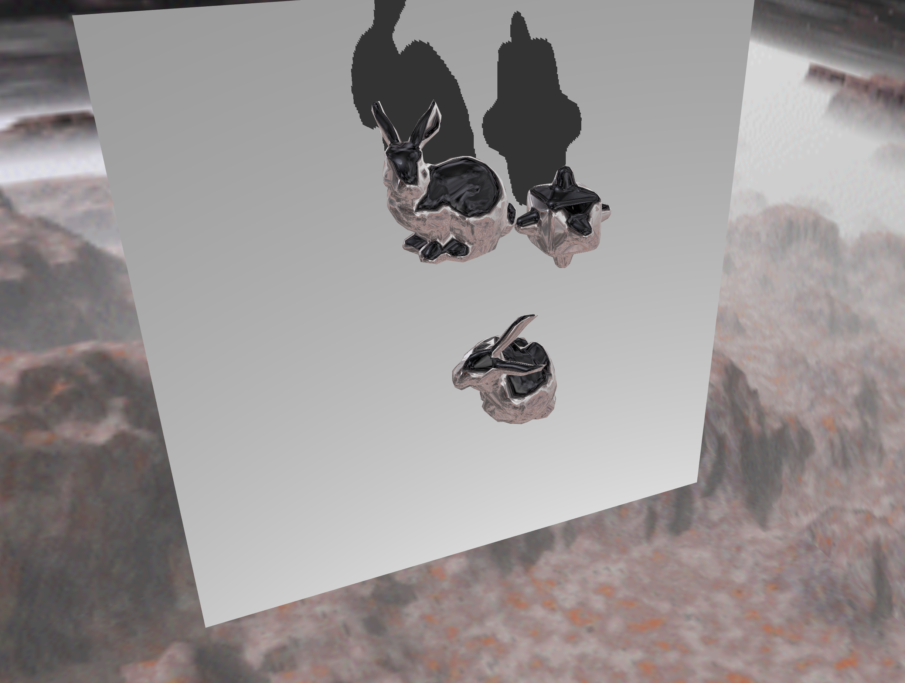

## 1. Shadow Mapping

Press 1, 2, 3 to add a new object at the origin.

Press + to change the color of shadow.

## 2. Environment Mapping

Click an object to select it, and then use - button to change the rendering setting of it.

## 3. Camera Control

Press w, a, s, d, q, e to change the direction and position of the camera.

